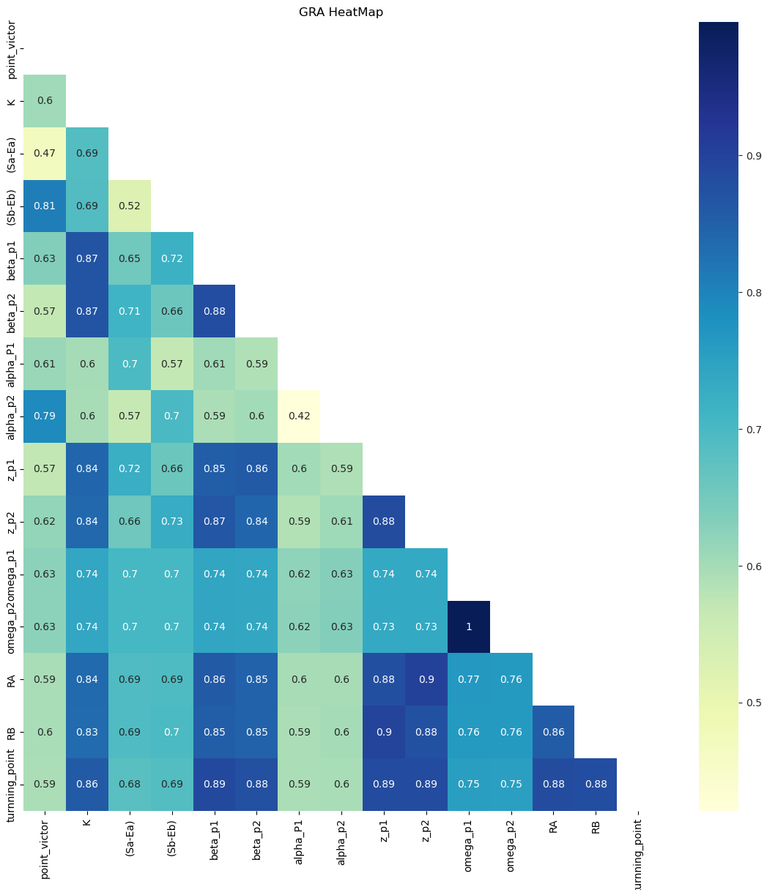

```python
#这一步预计得到转折点对应的势头和其他指标，比较列
```


```python
#这一步均值化
```

## 灰色关联分析法

对于两个系统之间的因素，其随时间或不同对象而变化的关联性大小的量度，称为关联度。在系统发展过程中，若两个因素变化的趋势具有一致性，即同步变化程度较高，即可谓二者关联程度较高；反之，则较低。因此，灰色关联分析方法，是根据因素之间发展趋势的相似或相异程度，亦即“灰色关联度”，作为衡量因素间关联程度的一种方法。

### 简介
灰色系统理论提出了对各子系统进行灰色关联度分析的概念，意图透过一定的方法，去寻求系统中各子系统（或因素）之间的数值关系。因此，灰色关联度分析对于一个系统发展变化态势提供了量化的度量，非常适合动态历程分析。
###  计算步骤
1. 确实参考数列与比较数列
2. 对参考数列与比较数列进行无量纲化处理
3. 计算关联系数,求关联度

此处我给出的是第三步的实现方式,无量纲化请自己处理.


```python
import pandas as pd
import numpy as np
from numpy import *
import matplotlib.pyplot as plt
%matplotlib inline

# 从硬盘读取数据进入内存
data = pd.read_csv(r"E:\code\meisai\source\2024\C\tableConvert.com_j48lxj.csv")
# data=data.iloc[0:7283,[8,22,23,24,25,26,27,28,29,30,31,32,33,34,35]]

data.head()
```


<div>
<style scoped>
    .dataframe tbody tr th:only-of-type {
        vertical-align: middle;
    }

    .dataframe tbody tr th {
        vertical-align: top;
    }

    .dataframe thead th {
        text-align: right;
    }
</style>
<table border="1" class="dataframe">
  <thead>
    <tr style="text-align: right;">
      <th></th>
      <th>point_victor</th>
      <th>K</th>
      <th>(Sa-Ea)</th>
      <th>(Sb-Eb)</th>
      <th>beta_p1</th>
      <th>beta_p2</th>
      <th>alpha_P1</th>
      <th>alpha_p2</th>
      <th>z_p1</th>
      <th>z_p2</th>
      <th>omega_p1</th>
      <th>omega_p2</th>
      <th>RA</th>
      <th>RB</th>
      <th>turnning_point</th>
    </tr>
  </thead>
  <tbody>
    <tr>
      <th>0</th>
      <td>2.0</td>
      <td>16.0</td>
      <td>-0.543066</td>
      <td>0.543066</td>
      <td>1.0</td>
      <td>0.0</td>
      <td>1.0</td>
      <td>0.0</td>
      <td>0.0</td>
      <td>0.0</td>
      <td>7.900</td>
      <td>7.840</td>
      <td>130.000000</td>
      <td>100.000000</td>
      <td>0.0</td>
    </tr>
    <tr>
      <th>1</th>
      <td>1.0</td>
      <td>16.0</td>
      <td>0.481844</td>
      <td>-0.481844</td>
      <td>0.0</td>
      <td>0.0</td>
      <td>1.0</td>
      <td>0.0</td>
      <td>0.0</td>
      <td>0.0</td>
      <td>13.613</td>
      <td>14.934</td>
      <td>110.615223</td>
      <td>98.686367</td>
      <td>0.0</td>
    </tr>
    <tr>
      <th>2</th>
      <td>2.0</td>
      <td>16.0</td>
      <td>-0.540267</td>
      <td>0.540267</td>
      <td>1.0</td>
      <td>0.0</td>
      <td>1.0</td>
      <td>0.0</td>
      <td>0.0</td>
      <td>0.0</td>
      <td>27.453</td>
      <td>34.742</td>
      <td>106.016751</td>
      <td>81.112790</td>
      <td>0.0</td>
    </tr>
    <tr>
      <th>3</th>
      <td>1.0</td>
      <td>16.0</td>
      <td>0.484531</td>
      <td>-0.484531</td>
      <td>0.0</td>
      <td>0.0</td>
      <td>1.0</td>
      <td>0.0</td>
      <td>0.0</td>
      <td>0.0</td>
      <td>78.761</td>
      <td>110.373</td>
      <td>89.069907</td>
      <td>81.633888</td>
      <td>0.0</td>
    </tr>
    <tr>
      <th>4</th>
      <td>1.0</td>
      <td>16.0</td>
      <td>0.462284</td>
      <td>-0.462284</td>
      <td>0.0</td>
      <td>0.0</td>
      <td>1.0</td>
      <td>0.0</td>
      <td>1.0</td>
      <td>-1.0</td>
      <td>79.050</td>
      <td>111.186</td>
      <td>86.642020</td>
      <td>65.751876</td>
      <td>0.0</td>
    </tr>
  </tbody>
</table>
</div>


```python
data
```


<div>
<style scoped>
    .dataframe tbody tr th:only-of-type {
        vertical-align: middle;
    }

    .dataframe tbody tr th {
        vertical-align: top;
    }

    .dataframe thead th {
        text-align: right;
    }
</style>
<table border="1" class="dataframe">
  <thead>
    <tr style="text-align: right;">
      <th></th>
      <th>point_victor</th>
      <th>K</th>
      <th>(Sa-Ea)</th>
      <th>(Sb-Eb)</th>
      <th>beta_p1</th>
      <th>beta_p2</th>
      <th>alpha_P1</th>
      <th>alpha_p2</th>
      <th>z_p1</th>
      <th>z_p2</th>
      <th>omega_p1</th>
      <th>omega_p2</th>
      <th>RA</th>
      <th>RB</th>
      <th>turnning_point</th>
    </tr>
  </thead>
  <tbody>
    <tr>
      <th>0</th>
      <td>2.0</td>
      <td>16.0</td>
      <td>-0.543066</td>
      <td>0.543066</td>
      <td>1.0</td>
      <td>0.0</td>
      <td>1.0</td>
      <td>0.0</td>
      <td>0.0</td>
      <td>0.0</td>
      <td>7.900</td>
      <td>7.840</td>
      <td>130.000000</td>
      <td>100.000000</td>
      <td>0.0</td>
    </tr>
    <tr>
      <th>1</th>
      <td>1.0</td>
      <td>16.0</td>
      <td>0.481844</td>
      <td>-0.481844</td>
      <td>0.0</td>
      <td>0.0</td>
      <td>1.0</td>
      <td>0.0</td>
      <td>0.0</td>
      <td>0.0</td>
      <td>13.613</td>
      <td>14.934</td>
      <td>110.615223</td>
      <td>98.686367</td>
      <td>0.0</td>
    </tr>
    <tr>
      <th>2</th>
      <td>2.0</td>
      <td>16.0</td>
      <td>-0.540267</td>
      <td>0.540267</td>
      <td>1.0</td>
      <td>0.0</td>
      <td>1.0</td>
      <td>0.0</td>
      <td>0.0</td>
      <td>0.0</td>
      <td>27.453</td>
      <td>34.742</td>
      <td>106.016751</td>
      <td>81.112790</td>
      <td>0.0</td>
    </tr>
    <tr>
      <th>3</th>
      <td>1.0</td>
      <td>16.0</td>
      <td>0.484531</td>
      <td>-0.484531</td>
      <td>0.0</td>
      <td>0.0</td>
      <td>1.0</td>
      <td>0.0</td>
      <td>0.0</td>
      <td>0.0</td>
      <td>78.761</td>
      <td>110.373</td>
      <td>89.069907</td>
      <td>81.633888</td>
      <td>0.0</td>
    </tr>
    <tr>
      <th>4</th>
      <td>1.0</td>
      <td>16.0</td>
      <td>0.462284</td>
      <td>-0.462284</td>
      <td>0.0</td>
      <td>0.0</td>
      <td>1.0</td>
      <td>0.0</td>
      <td>1.0</td>
      <td>-1.0</td>
      <td>79.050</td>
      <td>111.186</td>
      <td>86.642020</td>
      <td>65.751876</td>
      <td>0.0</td>
    </tr>
    <tr>
      <th>...</th>
      <td>...</td>
      <td>...</td>
      <td>...</td>
      <td>...</td>
      <td>...</td>
      <td>...</td>
      <td>...</td>
      <td>...</td>
      <td>...</td>
      <td>...</td>
      <td>...</td>
      <td>...</td>
      <td>...</td>
      <td>...</td>
      <td>...</td>
    </tr>
    <tr>
      <th>7278</th>
      <td>2.0</td>
      <td>16.0</td>
      <td>-0.479987</td>
      <td>0.479987</td>
      <td>1.0</td>
      <td>0.0</td>
      <td>1.0</td>
      <td>0.0</td>
      <td>-1.0</td>
      <td>1.0</td>
      <td>101902.632</td>
      <td>100890.568</td>
      <td>26.492413</td>
      <td>-32.893606</td>
      <td>0.0</td>
    </tr>
    <tr>
      <th>7279</th>
      <td>1.0</td>
      <td>16.0</td>
      <td>0.542028</td>
      <td>-0.542028</td>
      <td>0.0</td>
      <td>0.0</td>
      <td>1.0</td>
      <td>0.0</td>
      <td>0.0</td>
      <td>0.0</td>
      <td>101941.172</td>
      <td>100941.539</td>
      <td>49.349994</td>
      <td>-52.426322</td>
      <td>0.0</td>
    </tr>
    <tr>
      <th>7280</th>
      <td>1.0</td>
      <td>16.0</td>
      <td>0.517160</td>
      <td>-0.517160</td>
      <td>0.0</td>
      <td>0.0</td>
      <td>1.0</td>
      <td>0.0</td>
      <td>1.0</td>
      <td>-1.0</td>
      <td>101958.525</td>
      <td>100969.305</td>
      <td>16.691296</td>
      <td>-21.200650</td>
      <td>0.0</td>
    </tr>
    <tr>
      <th>7281</th>
      <td>2.0</td>
      <td>16.0</td>
      <td>-0.506649</td>
      <td>0.506649</td>
      <td>0.0</td>
      <td>0.0</td>
      <td>1.0</td>
      <td>0.0</td>
      <td>0.0</td>
      <td>0.0</td>
      <td>101969.607</td>
      <td>100987.633</td>
      <td>-11.250548</td>
      <td>5.904115</td>
      <td>0.0</td>
    </tr>
    <tr>
      <th>7282</th>
      <td>1.0</td>
      <td>16.0</td>
      <td>0.516676</td>
      <td>-0.516676</td>
      <td>0.0</td>
      <td>0.0</td>
      <td>1.0</td>
      <td>0.0</td>
      <td>0.0</td>
      <td>0.0</td>
      <td>101977.620</td>
      <td>100998.170</td>
      <td>15.797751</td>
      <td>-18.988165</td>
      <td>0.0</td>
    </tr>
  </tbody>
</table>
<p>7283 rows × 15 columns</p>
</div>


```python
# 无量纲化
def dimensionlessProcessing(df):
    newDataFrame = pd.DataFrame(index=df.index)
    columns = df.columns.tolist()
    for c in columns:
        d = df[c]
        MAX = d.max()
        MIN = d.min()
        MEAN = d.mean()
        newDataFrame[c] = ((d - MEAN) / (MAX - MIN)).tolist()
    return newDataFrame

def GRA_ONE(gray, m=0):
    # 读取为df格式
    gray = dimensionlessProcessing(gray)
    # 标准化
    std = gray.iloc[:, m]  # 为标准要素
    gray.drop(str(m),axis=1,inplace=True)
    ce = gray.iloc[:, 0:]  # 为比较要素
    shape_n, shape_m = ce.shape[0], ce.shape[1]  # 计算行列

    # 与标准要素比较，相减
    a = zeros([shape_m, shape_n])
    for i in range(shape_m):
        for j in range(shape_n):
            a[i, j] = abs(ce.iloc[j, i] - std[j])

    # 取出矩阵中最大值与最小值
    c, d = amax(a), amin(a)

    # 计算值
    result = zeros([shape_m, shape_n])
    for i in range(shape_m):
        for j in range(shape_n):
            result[i, j] = (d + 0.5 * c) / (a[i, j] + 0.5 * c)

    # 求均值，得到灰色关联值,并返回
    result_list = [mean(result[i, :]) for i in range(shape_m)]
    result_list.insert(m,1)
    return pd.DataFrame(result_list)


def GRA(DataFrame):
    df = DataFrame.copy()
    list_columns = [
        str(s) for s in range(len(df.columns)) if s not in [None]
    ]
    df_local = pd.DataFrame(columns=list_columns)
    df.columns=list_columns
    for i in range(len(df.columns)):
        df_local.iloc[:, i] = GRA_ONE(df, m=i)[0]
    return df_local
```


```python
data_gra = GRA(data)
# data_wine_gra.to_csv(path+"GRA.csv") 存储结果到硬盘
data_gra
```

    C:\Users\wandering_leaf\AppData\Local\Temp\ipykernel_4412\1828408359.py:51: DeprecationWarning: In a future version, `df.iloc[:, i] = newvals` will attempt to set the values inplace instead of always setting a new array. To retain the old behavior, use either `df[df.columns[i]] = newvals` or, if columns are non-unique, `df.isetitem(i, newvals)`
      df_local.iloc[:, i] = GRA_ONE(df, m=i)[0]
    C:\Users\wandering_leaf\AppData\Local\Temp\ipykernel_4412\1828408359.py:51: DeprecationWarning: In a future version, `df.iloc[:, i] = newvals` will attempt to set the values inplace instead of always setting a new array. To retain the old behavior, use either `df[df.columns[i]] = newvals` or, if columns are non-unique, `df.isetitem(i, newvals)`
      df_local.iloc[:, i] = GRA_ONE(df, m=i)[0]
    C:\Users\wandering_leaf\AppData\Local\Temp\ipykernel_4412\1828408359.py:51: DeprecationWarning: In a future version, `df.iloc[:, i] = newvals` will attempt to set the values inplace instead of always setting a new array. To retain the old behavior, use either `df[df.columns[i]] = newvals` or, if columns are non-unique, `df.isetitem(i, newvals)`
      df_local.iloc[:, i] = GRA_ONE(df, m=i)[0]
    C:\Users\wandering_leaf\AppData\Local\Temp\ipykernel_4412\1828408359.py:51: DeprecationWarning: In a future version, `df.iloc[:, i] = newvals` will attempt to set the values inplace instead of always setting a new array. To retain the old behavior, use either `df[df.columns[i]] = newvals` or, if columns are non-unique, `df.isetitem(i, newvals)`
      df_local.iloc[:, i] = GRA_ONE(df, m=i)[0]
    C:\Users\wandering_leaf\AppData\Local\Temp\ipykernel_4412\1828408359.py:51: DeprecationWarning: In a future version, `df.iloc[:, i] = newvals` will attempt to set the values inplace instead of always setting a new array. To retain the old behavior, use either `df[df.columns[i]] = newvals` or, if columns are non-unique, `df.isetitem(i, newvals)`
      df_local.iloc[:, i] = GRA_ONE(df, m=i)[0]
    C:\Users\wandering_leaf\AppData\Local\Temp\ipykernel_4412\1828408359.py:51: DeprecationWarning: In a future version, `df.iloc[:, i] = newvals` will attempt to set the values inplace instead of always setting a new array. To retain the old behavior, use either `df[df.columns[i]] = newvals` or, if columns are non-unique, `df.isetitem(i, newvals)`
      df_local.iloc[:, i] = GRA_ONE(df, m=i)[0]
    C:\Users\wandering_leaf\AppData\Local\Temp\ipykernel_4412\1828408359.py:51: DeprecationWarning: In a future version, `df.iloc[:, i] = newvals` will attempt to set the values inplace instead of always setting a new array. To retain the old behavior, use either `df[df.columns[i]] = newvals` or, if columns are non-unique, `df.isetitem(i, newvals)`
      df_local.iloc[:, i] = GRA_ONE(df, m=i)[0]
    C:\Users\wandering_leaf\AppData\Local\Temp\ipykernel_4412\1828408359.py:51: DeprecationWarning: In a future version, `df.iloc[:, i] = newvals` will attempt to set the values inplace instead of always setting a new array. To retain the old behavior, use either `df[df.columns[i]] = newvals` or, if columns are non-unique, `df.isetitem(i, newvals)`
      df_local.iloc[:, i] = GRA_ONE(df, m=i)[0]
    C:\Users\wandering_leaf\AppData\Local\Temp\ipykernel_4412\1828408359.py:51: DeprecationWarning: In a future version, `df.iloc[:, i] = newvals` will attempt to set the values inplace instead of always setting a new array. To retain the old behavior, use either `df[df.columns[i]] = newvals` or, if columns are non-unique, `df.isetitem(i, newvals)`
      df_local.iloc[:, i] = GRA_ONE(df, m=i)[0]
    C:\Users\wandering_leaf\AppData\Local\Temp\ipykernel_4412\1828408359.py:51: DeprecationWarning: In a future version, `df.iloc[:, i] = newvals` will attempt to set the values inplace instead of always setting a new array. To retain the old behavior, use either `df[df.columns[i]] = newvals` or, if columns are non-unique, `df.isetitem(i, newvals)`
      df_local.iloc[:, i] = GRA_ONE(df, m=i)[0]
    C:\Users\wandering_leaf\AppData\Local\Temp\ipykernel_4412\1828408359.py:51: DeprecationWarning: In a future version, `df.iloc[:, i] = newvals` will attempt to set the values inplace instead of always setting a new array. To retain the old behavior, use either `df[df.columns[i]] = newvals` or, if columns are non-unique, `df.isetitem(i, newvals)`
      df_local.iloc[:, i] = GRA_ONE(df, m=i)[0]
    C:\Users\wandering_leaf\AppData\Local\Temp\ipykernel_4412\1828408359.py:51: DeprecationWarning: In a future version, `df.iloc[:, i] = newvals` will attempt to set the values inplace instead of always setting a new array. To retain the old behavior, use either `df[df.columns[i]] = newvals` or, if columns are non-unique, `df.isetitem(i, newvals)`
      df_local.iloc[:, i] = GRA_ONE(df, m=i)[0]
    C:\Users\wandering_leaf\AppData\Local\Temp\ipykernel_4412\1828408359.py:51: DeprecationWarning: In a future version, `df.iloc[:, i] = newvals` will attempt to set the values inplace instead of always setting a new array. To retain the old behavior, use either `df[df.columns[i]] = newvals` or, if columns are non-unique, `df.isetitem(i, newvals)`
      df_local.iloc[:, i] = GRA_ONE(df, m=i)[0]
    C:\Users\wandering_leaf\AppData\Local\Temp\ipykernel_4412\1828408359.py:51: DeprecationWarning: In a future version, `df.iloc[:, i] = newvals` will attempt to set the values inplace instead of always setting a new array. To retain the old behavior, use either `df[df.columns[i]] = newvals` or, if columns are non-unique, `df.isetitem(i, newvals)`
      df_local.iloc[:, i] = GRA_ONE(df, m=i)[0]
    


<div>
<style scoped>
    .dataframe tbody tr th:only-of-type {
        vertical-align: middle;
    }

    .dataframe tbody tr th {
        vertical-align: top;
    }

    .dataframe thead th {
        text-align: right;
    }
</style>
<table border="1" class="dataframe">
  <thead>
    <tr style="text-align: right;">
      <th></th>
      <th>0</th>
      <th>1</th>
      <th>2</th>
      <th>3</th>
      <th>4</th>
      <th>5</th>
      <th>6</th>
      <th>7</th>
      <th>8</th>
      <th>9</th>
      <th>10</th>
      <th>11</th>
      <th>12</th>
      <th>13</th>
      <th>14</th>
    </tr>
  </thead>
  <tbody>
    <tr>
      <th>0</th>
      <td>1.000000</td>
      <td>0.598843</td>
      <td>0.460627</td>
      <td>0.803439</td>
      <td>0.632598</td>
      <td>0.561127</td>
      <td>0.609902</td>
      <td>0.793414</td>
      <td>0.531639</td>
      <td>0.580507</td>
      <td>0.624249</td>
      <td>0.624934</td>
      <td>0.556647</td>
      <td>0.567813</td>
      <td>0.597150</td>
    </tr>
    <tr>
      <th>1</th>
      <td>0.603625</td>
      <td>1.000000</td>
      <td>0.684331</td>
      <td>0.689804</td>
      <td>0.870563</td>
      <td>0.870500</td>
      <td>0.605030</td>
      <td>0.606601</td>
      <td>0.822714</td>
      <td>0.821160</td>
      <td>0.742311</td>
      <td>0.741739</td>
      <td>0.818527</td>
      <td>0.821858</td>
      <td>0.863228</td>
    </tr>
    <tr>
      <th>2</th>
      <td>0.469570</td>
      <td>0.687405</td>
      <td>1.000000</td>
      <td>0.528619</td>
      <td>0.660515</td>
      <td>0.714159</td>
      <td>0.703153</td>
      <td>0.576359</td>
      <td>0.699460</td>
      <td>0.628757</td>
      <td>0.709662</td>
      <td>0.709461</td>
      <td>0.666424</td>
      <td>0.674570</td>
      <td>0.691148</td>
    </tr>
    <tr>
      <th>3</th>
      <td>0.806608</td>
      <td>0.689767</td>
      <td>0.524841</td>
      <td>1.000000</td>
      <td>0.720815</td>
      <td>0.656447</td>
      <td>0.573174</td>
      <td>0.705794</td>
      <td>0.628470</td>
      <td>0.699711</td>
      <td>0.707086</td>
      <td>0.706953</td>
      <td>0.665246</td>
      <td>0.675549</td>
      <td>0.693833</td>
    </tr>
    <tr>
      <th>4</th>
      <td>0.634437</td>
      <td>0.869553</td>
      <td>0.654535</td>
      <td>0.718419</td>
      <td>1.000000</td>
      <td>0.879665</td>
      <td>0.606952</td>
      <td>0.598795</td>
      <td>0.834399</td>
      <td>0.848985</td>
      <td>0.743173</td>
      <td>0.742486</td>
      <td>0.841164</td>
      <td>0.842117</td>
      <td>0.890695</td>
    </tr>
    <tr>
      <th>5</th>
      <td>0.567550</td>
      <td>0.870943</td>
      <td>0.712355</td>
      <td>0.657740</td>
      <td>0.880924</td>
      <td>1.000000</td>
      <td>0.594997</td>
      <td>0.611405</td>
      <td>0.844888</td>
      <td>0.825419</td>
      <td>0.742929</td>
      <td>0.742310</td>
      <td>0.833190</td>
      <td>0.835785</td>
      <td>0.881238</td>
    </tr>
    <tr>
      <th>6</th>
      <td>0.609902</td>
      <td>0.600254</td>
      <td>0.696637</td>
      <td>0.568619</td>
      <td>0.605041</td>
      <td>0.588801</td>
      <td>1.000000</td>
      <td>0.424095</td>
      <td>0.564208</td>
      <td>0.547940</td>
      <td>0.622508</td>
      <td>0.623187</td>
      <td>0.559361</td>
      <td>0.565567</td>
      <td>0.596342</td>
    </tr>
    <tr>
      <th>7</th>
      <td>0.791943</td>
      <td>0.598524</td>
      <td>0.565251</td>
      <td>0.699404</td>
      <td>0.593522</td>
      <td>0.601965</td>
      <td>0.420590</td>
      <td>1.000000</td>
      <td>0.547634</td>
      <td>0.564511</td>
      <td>0.628064</td>
      <td>0.628834</td>
      <td>0.554847</td>
      <td>0.569234</td>
      <td>0.595332</td>
    </tr>
    <tr>
      <th>8</th>
      <td>0.570984</td>
      <td>0.840142</td>
      <td>0.724098</td>
      <td>0.660050</td>
      <td>0.851984</td>
      <td>0.859864</td>
      <td>0.602711</td>
      <td>0.590027</td>
      <td>1.000000</td>
      <td>0.882728</td>
      <td>0.762814</td>
      <td>0.761861</td>
      <td>0.878186</td>
      <td>0.903175</td>
      <td>0.900621</td>
    </tr>
    <tr>
      <th>9</th>
      <td>0.618280</td>
      <td>0.838609</td>
      <td>0.656655</td>
      <td>0.727025</td>
      <td>0.865447</td>
      <td>0.841594</td>
      <td>0.586550</td>
      <td>0.606145</td>
      <td>0.882623</td>
      <td>1.000000</td>
      <td>0.762264</td>
      <td>0.761315</td>
      <td>0.901875</td>
      <td>0.879339</td>
      <td>0.899600</td>
    </tr>
    <tr>
      <th>10</th>
      <td>0.625062</td>
      <td>0.739361</td>
      <td>0.703898</td>
      <td>0.704032</td>
      <td>0.742404</td>
      <td>0.738964</td>
      <td>0.623323</td>
      <td>0.631912</td>
      <td>0.735936</td>
      <td>0.735589</td>
      <td>1.000000</td>
      <td>0.997390</td>
      <td>0.739534</td>
      <td>0.745053</td>
      <td>0.757672</td>
    </tr>
    <tr>
      <th>11</th>
      <td>0.625541</td>
      <td>0.738618</td>
      <td>0.703521</td>
      <td>0.703722</td>
      <td>0.741548</td>
      <td>0.738171</td>
      <td>0.623796</td>
      <td>0.632469</td>
      <td>0.734747</td>
      <td>0.734407</td>
      <td>0.997388</td>
      <td>1.000000</td>
      <td>0.738343</td>
      <td>0.743900</td>
      <td>0.756674</td>
    </tr>
    <tr>
      <th>12</th>
      <td>0.594774</td>
      <td>0.835965</td>
      <td>0.692263</td>
      <td>0.694255</td>
      <td>0.857999</td>
      <td>0.848656</td>
      <td>0.597393</td>
      <td>0.596493</td>
      <td>0.877985</td>
      <td>0.901805</td>
      <td>0.765670</td>
      <td>0.764712</td>
      <td>1.000000</td>
      <td>0.860587</td>
      <td>0.898270</td>
    </tr>
    <tr>
      <th>13</th>
      <td>0.595922</td>
      <td>0.834085</td>
      <td>0.691591</td>
      <td>0.695708</td>
      <td>0.854437</td>
      <td>0.846471</td>
      <td>0.593739</td>
      <td>0.600745</td>
      <td>0.899613</td>
      <td>0.875247</td>
      <td>0.764146</td>
      <td>0.763206</td>
      <td>0.856184</td>
      <td>1.000000</td>
      <td>0.893484</td>
    </tr>
    <tr>
      <th>14</th>
      <td>0.593774</td>
      <td>0.859781</td>
      <td>0.680607</td>
      <td>0.686559</td>
      <td>0.888994</td>
      <td>0.877847</td>
      <td>0.592964</td>
      <td>0.595393</td>
      <td>0.886229</td>
      <td>0.885105</td>
      <td>0.754617</td>
      <td>0.753777</td>
      <td>0.883779</td>
      <td>0.882121</td>
      <td>1.000000</td>
    </tr>
  </tbody>
</table>
</div>


```python
data_gra.columns = data.columns
data_gra.index = data.columns
data_gra
```


<div>
<style scoped>
    .dataframe tbody tr th:only-of-type {
        vertical-align: middle;
    }

    .dataframe tbody tr th {
        vertical-align: top;
    }

    .dataframe thead th {
        text-align: right;
    }
</style>
<table border="1" class="dataframe">
  <thead>
    <tr style="text-align: right;">
      <th></th>
      <th>point_victor</th>
      <th>K</th>
      <th>(Sa-Ea)</th>
      <th>(Sb-Eb)</th>
      <th>beta_p1</th>
      <th>beta_p2</th>
      <th>alpha_P1</th>
      <th>alpha_p2</th>
      <th>z_p1</th>
      <th>z_p2</th>
      <th>omega_p1</th>
      <th>omega_p2</th>
      <th>RA</th>
      <th>RB</th>
      <th>turnning_point</th>
    </tr>
  </thead>
  <tbody>
    <tr>
      <th>point_victor</th>
      <td>1.000000</td>
      <td>0.598843</td>
      <td>0.460627</td>
      <td>0.803439</td>
      <td>0.632598</td>
      <td>0.561127</td>
      <td>0.609902</td>
      <td>0.793414</td>
      <td>0.531639</td>
      <td>0.580507</td>
      <td>0.624249</td>
      <td>0.624934</td>
      <td>0.556647</td>
      <td>0.567813</td>
      <td>0.597150</td>
    </tr>
    <tr>
      <th>K</th>
      <td>0.603625</td>
      <td>1.000000</td>
      <td>0.684331</td>
      <td>0.689804</td>
      <td>0.870563</td>
      <td>0.870500</td>
      <td>0.605030</td>
      <td>0.606601</td>
      <td>0.822714</td>
      <td>0.821160</td>
      <td>0.742311</td>
      <td>0.741739</td>
      <td>0.818527</td>
      <td>0.821858</td>
      <td>0.863228</td>
    </tr>
    <tr>
      <th>(Sa-Ea)</th>
      <td>0.469570</td>
      <td>0.687405</td>
      <td>1.000000</td>
      <td>0.528619</td>
      <td>0.660515</td>
      <td>0.714159</td>
      <td>0.703153</td>
      <td>0.576359</td>
      <td>0.699460</td>
      <td>0.628757</td>
      <td>0.709662</td>
      <td>0.709461</td>
      <td>0.666424</td>
      <td>0.674570</td>
      <td>0.691148</td>
    </tr>
    <tr>
      <th>(Sb-Eb)</th>
      <td>0.806608</td>
      <td>0.689767</td>
      <td>0.524841</td>
      <td>1.000000</td>
      <td>0.720815</td>
      <td>0.656447</td>
      <td>0.573174</td>
      <td>0.705794</td>
      <td>0.628470</td>
      <td>0.699711</td>
      <td>0.707086</td>
      <td>0.706953</td>
      <td>0.665246</td>
      <td>0.675549</td>
      <td>0.693833</td>
    </tr>
    <tr>
      <th>beta_p1</th>
      <td>0.634437</td>
      <td>0.869553</td>
      <td>0.654535</td>
      <td>0.718419</td>
      <td>1.000000</td>
      <td>0.879665</td>
      <td>0.606952</td>
      <td>0.598795</td>
      <td>0.834399</td>
      <td>0.848985</td>
      <td>0.743173</td>
      <td>0.742486</td>
      <td>0.841164</td>
      <td>0.842117</td>
      <td>0.890695</td>
    </tr>
    <tr>
      <th>beta_p2</th>
      <td>0.567550</td>
      <td>0.870943</td>
      <td>0.712355</td>
      <td>0.657740</td>
      <td>0.880924</td>
      <td>1.000000</td>
      <td>0.594997</td>
      <td>0.611405</td>
      <td>0.844888</td>
      <td>0.825419</td>
      <td>0.742929</td>
      <td>0.742310</td>
      <td>0.833190</td>
      <td>0.835785</td>
      <td>0.881238</td>
    </tr>
    <tr>
      <th>alpha_P1</th>
      <td>0.609902</td>
      <td>0.600254</td>
      <td>0.696637</td>
      <td>0.568619</td>
      <td>0.605041</td>
      <td>0.588801</td>
      <td>1.000000</td>
      <td>0.424095</td>
      <td>0.564208</td>
      <td>0.547940</td>
      <td>0.622508</td>
      <td>0.623187</td>
      <td>0.559361</td>
      <td>0.565567</td>
      <td>0.596342</td>
    </tr>
    <tr>
      <th>alpha_p2</th>
      <td>0.791943</td>
      <td>0.598524</td>
      <td>0.565251</td>
      <td>0.699404</td>
      <td>0.593522</td>
      <td>0.601965</td>
      <td>0.420590</td>
      <td>1.000000</td>
      <td>0.547634</td>
      <td>0.564511</td>
      <td>0.628064</td>
      <td>0.628834</td>
      <td>0.554847</td>
      <td>0.569234</td>
      <td>0.595332</td>
    </tr>
    <tr>
      <th>z_p1</th>
      <td>0.570984</td>
      <td>0.840142</td>
      <td>0.724098</td>
      <td>0.660050</td>
      <td>0.851984</td>
      <td>0.859864</td>
      <td>0.602711</td>
      <td>0.590027</td>
      <td>1.000000</td>
      <td>0.882728</td>
      <td>0.762814</td>
      <td>0.761861</td>
      <td>0.878186</td>
      <td>0.903175</td>
      <td>0.900621</td>
    </tr>
    <tr>
      <th>z_p2</th>
      <td>0.618280</td>
      <td>0.838609</td>
      <td>0.656655</td>
      <td>0.727025</td>
      <td>0.865447</td>
      <td>0.841594</td>
      <td>0.586550</td>
      <td>0.606145</td>
      <td>0.882623</td>
      <td>1.000000</td>
      <td>0.762264</td>
      <td>0.761315</td>
      <td>0.901875</td>
      <td>0.879339</td>
      <td>0.899600</td>
    </tr>
    <tr>
      <th>omega_p1</th>
      <td>0.625062</td>
      <td>0.739361</td>
      <td>0.703898</td>
      <td>0.704032</td>
      <td>0.742404</td>
      <td>0.738964</td>
      <td>0.623323</td>
      <td>0.631912</td>
      <td>0.735936</td>
      <td>0.735589</td>
      <td>1.000000</td>
      <td>0.997390</td>
      <td>0.739534</td>
      <td>0.745053</td>
      <td>0.757672</td>
    </tr>
    <tr>
      <th>omega_p2</th>
      <td>0.625541</td>
      <td>0.738618</td>
      <td>0.703521</td>
      <td>0.703722</td>
      <td>0.741548</td>
      <td>0.738171</td>
      <td>0.623796</td>
      <td>0.632469</td>
      <td>0.734747</td>
      <td>0.734407</td>
      <td>0.997388</td>
      <td>1.000000</td>
      <td>0.738343</td>
      <td>0.743900</td>
      <td>0.756674</td>
    </tr>
    <tr>
      <th>RA</th>
      <td>0.594774</td>
      <td>0.835965</td>
      <td>0.692263</td>
      <td>0.694255</td>
      <td>0.857999</td>
      <td>0.848656</td>
      <td>0.597393</td>
      <td>0.596493</td>
      <td>0.877985</td>
      <td>0.901805</td>
      <td>0.765670</td>
      <td>0.764712</td>
      <td>1.000000</td>
      <td>0.860587</td>
      <td>0.898270</td>
    </tr>
    <tr>
      <th>RB</th>
      <td>0.595922</td>
      <td>0.834085</td>
      <td>0.691591</td>
      <td>0.695708</td>
      <td>0.854437</td>
      <td>0.846471</td>
      <td>0.593739</td>
      <td>0.600745</td>
      <td>0.899613</td>
      <td>0.875247</td>
      <td>0.764146</td>
      <td>0.763206</td>
      <td>0.856184</td>
      <td>1.000000</td>
      <td>0.893484</td>
    </tr>
    <tr>
      <th>turnning_point</th>
      <td>0.593774</td>
      <td>0.859781</td>
      <td>0.680607</td>
      <td>0.686559</td>
      <td>0.888994</td>
      <td>0.877847</td>
      <td>0.592964</td>
      <td>0.595393</td>
      <td>0.886229</td>
      <td>0.885105</td>
      <td>0.754617</td>
      <td>0.753777</td>
      <td>0.883779</td>
      <td>0.882121</td>
      <td>1.000000</td>
    </tr>
  </tbody>
</table>
</div>


```python
# 灰色关联结果矩阵可视化
import seaborn as sns

def ShowGRAHeatMap(DataFrame):
    colormap = plt.cm.RdBu
    ylabels = DataFrame.columns.values.tolist()
    f, ax = plt.subplots(figsize=(14, 14))
    ax.set_title('GRA HeatMap')
    
    # 设置展示一半，如果不需要注释掉mask即可
    mask = np.zeros_like(DataFrame)
    mask[np.triu_indices_from(mask)] = True
    
    with sns.axes_style("white"):
        sns.heatmap(DataFrame,
                    cmap="YlGnBu",
                    annot=True,
                    mask=mask,
                   )
    plt.show()

ShowGRAHeatMap(data_gra)
```


    

    


## 代码运算性能对比
一段来至于其他博客的纯pd代码，主要用于对比性能。测试这个纯pd确实比我的np为主的代码慢很多。


```python
import pandas as pd
# x=pd.read_excel('data.xlsx')
# x=x.iloc[:,1:].T

x = wine.T
import time
t1= time.time()
# 1、数据均值化处理
x_mean=x.mean(axis=1)
for i in range(x.index.size):
    x.iloc[i,:] = x.iloc[i,:]/x_mean[i]

# 2、提取参考队列和比较队列
ck=x.iloc[0,:]
cp=x.iloc[1:,:]

# 比较队列与参考队列相减
t=pd.DataFrame()
for j in range(cp.index.size):
    temp=pd.Series(cp.iloc[j,:]-ck)
    t=t.append(temp,ignore_index=True)

#求最大差和最小差
mmax=t.abs().max().max()
mmin=t.abs().min().min()
rho=0.5
#3、求关联系数
ksi=((mmin+rho*mmax)/(abs(t)+rho*mmax))


#4、求关联度
r=ksi.sum(axis=1)/ksi.columns.size
t2= time.time()
print(t2-t1)
#5、关联度排序，得到结果r3>r2>r1
result=r.sort_values(ascending=False)
```

    0.5984435081481934
    


```python
r,mmax,mmin
```


    (0     0.899110
     1     0.864843
     2     0.918599
     3     0.929425
     4     0.853435
     5     0.850764
     6     0.950577
     7     0.943061
     8     0.936841
     9     0.945681
     10    0.944877
     dtype: float64, 6.060007162917876, 3.460713527747572e-05)


## 参考文章
1. [百度百科 灰色关联分析法](https://baike.baidu.com/item/%E7%81%B0%E8%89%B2%E5%85%B3%E8%81%94%E5%88%86%E6%9E%90%E6%B3%95/8602076?fr=aladdin)
2. [简书 Python实现灰色关联](https://www.jianshu.com/p/7f9325551348)
